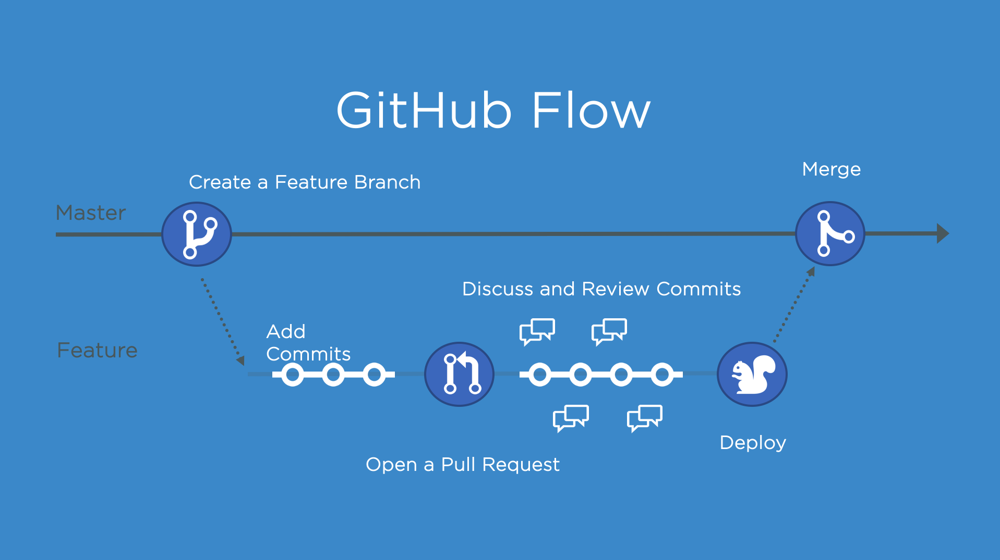

## GitHub Flow

O fluxo de trabalho no git funciona com 2 tipos de branchs:

A main, que é a branch principal do repositório;

E várias branchs secundárias, que servem para criar features, hotfix, upgrades ou qualquer outra coisa que você precisar.

Deve ser criada uma nova branch, a partir da main, antes de fazer qualquer alteração no projeto.

Você vai adicionar seus commits na branch e depois abrir um pull request.

E enquanto o pull request estiver aberto, você pode ir adicionando novos commits.

O que permite você discutir com sua equipe e, caso necessário, realizar alguma alteração.

Depois que o pull request é criado, o serviço de integração continua (CI) executa todos os processos para validar o seu código…

Como por exemplo: testes unitários, testes de integração, validações, build…

E se todas as verificações passarem, é feito o deploy do projeto em um ambiente de teste ou homologação.

Com o pull request aprovado e testado em um ambiente seguro, o caminho está limpo para realizar o merge com a branch main. 

Assim suas alterações devem aparecer na branch principal, e seu projeto estará pronto para o deploy em produção. 

